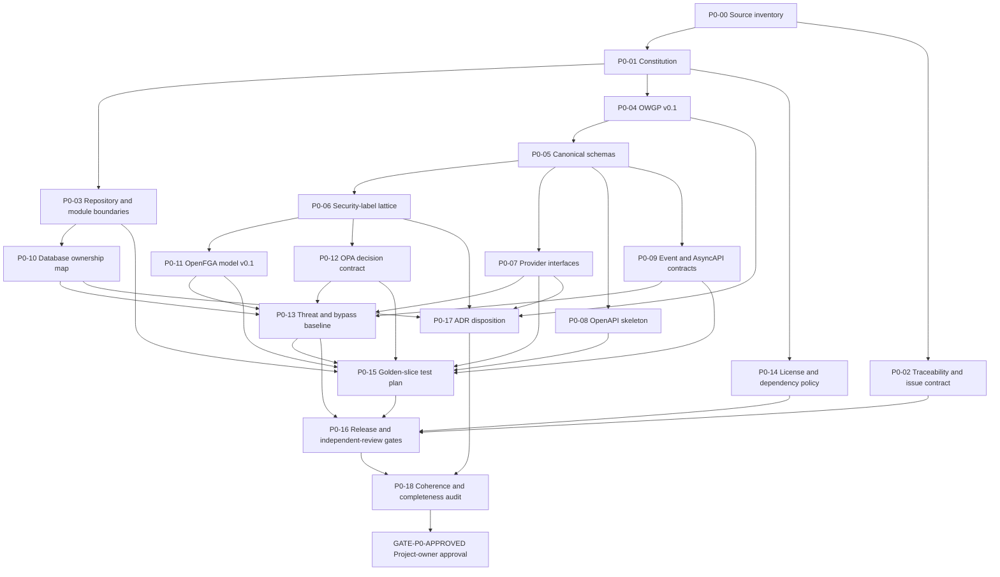

# Phase 0 artifact backlog

**Status:** Draft; no item in this backlog authorizes Phase 1 implementation. 
**Gate:** `GATE-P0-APPROVED` requires explicit project-owner approval of immutable artifact versions.

The detailed issue records and mandatory implementation fields live in [`implementation-issue-catalog.yaml`](implementation-issue-catalog.yaml). This backlog is the dependency and review view for the architecture-constitution milestone.

## Dependency order

Dependencies are finish-to-start unless an issue explicitly limits the dependency to a reviewed draft. Parallel drafting is allowed only across non-overlapping owned files. A downstream artifact cannot be approved against a dependency that is still materially changing.

The compact `P0-00`…`P0-18` labels in this document are artifact work packages, not a second issue registry. Canonical tracked issue IDs are the `STEAD-*` records in [`implementation-issue-catalog.yaml`](implementation-issue-catalog.yaml). Their crosswalk is:

| Artifact work package(s) | Canonical tracked issue(s) |
|---|---|
| `P0-00`, `P0-02`, `P0-13`, `P0-14`, `P0-15`, `P0-16`, `P0-18` | `STEAD-P0-014`; `P0-14` receives WS-01 guardrail review, and `P0-15` also consumes `STEAD-P0-015` plus component-owner seam evidence |
| `P0-01`, `P0-03`, `P0-17` | `STEAD-P0-001`; `P0-03` also uses `STEAD-P0-003` |
| `P0-04`, `P0-05`, `P0-08` | `STEAD-P0-002`; OpenAPI governance also uses `STEAD-P0-001` |
| `P0-06`, `P0-11`, `P0-12` | `STEAD-P0-007` |
| `P0-07` | Capability owners `STEAD-P0-004`, `005`, `007`, `008`, `009`, `010`, `011`, `012`; `STEAD-P0-001` integrates provider conventions |
| `P0-09` | `STEAD-P0-008` for events/publishing/consumption and `STEAD-P0-003` for the `EVT-002` transactional-outbox boundary |
| `P0-10` | `STEAD-P0-003` plus each namespace-owning `STEAD-P0-*` contract issue |
| Agent-ready seam work across `P0-05`–`P0-13`, `P0-15`, `P0-18` | `STEAD-P0-015`, which integrates but does not co-edit owner contracts |
| `GATE-P0-APPROVED` | The canonical gate record of the same ID |

## Artifact issues

| Order | Issue | Owner | Requirement focus | Deliverable and acceptance evidence | Depends on | State |
|---:|---|---|---|---|---|---|
| 0 | `P0-00` Source inventory | WS-13; WS-01 and WS-06 review normative and security extraction | All 115 named IDs; directive sections 0–24 | Immutable directive checksum; extracted unique-ID list; no missing/extra/duplicate IDs | — | Drafting |
| 1 | `P0-01` Architecture constitution | WS-01 | PRIN-001–012; locked decisions 1–20 | Precedence, invariants, phase freeze, change control, and approval record match the directive | P0-00 | Draft |
| 2 | `P0-02` Traceability and issue contract | WS-13 | TEST-001; §0; §20; §22 | Machine-readable requirement-to-issue/test/doc/release register; every issue has all mandatory fields; validator passes | P0-00 | Drafting |
| 3 | `P0-03` Repository/module boundaries | WS-01 repository/architecture editor; WS-02 runtime/database-boundary integrator | ARCH-001–004; PRIN-002,005 | Required logical tree, runtime boundaries, database ownership rules, and prohibited imports/writes are explicit | P0-01 | Drafting |
| 4 | `P0-04` OWGP v0.1 | WS-01 | STD-001–002; PRIN-004,006 | Canonical URIs, JSON resources, OSLC/PROV mapping, relationships/cardinalities, compatibility, export/import conformance | P0-01 | Backlog |
| 5 | `P0-05` Canonical schemas | WS-01 common/resource integration; WS-06 Principal leaf; WS-02 assignment leaf | ARCH-005; DOM-001–006; AGENT-001–002 | JSON Schema 2020-12 definitions for the fixed resource envelope/entities/work/docs/relationships plus a principal discriminator (`user`, `agent`, `service_account`) and provider-independent assignment; negative ontology/human-assumption tests | P0-04 | Backlog |
| 6 | `P0-06` Security-label schema and lattice | WS-06 | DOM-007; CLS-001–005,008; AGENT-003,006 | Versioned label/profile schemas, join semantics, container ceilings, raise/downgrade rules, propagation, cross-domain denies, and future delegator/agent/task/runtime/session/resource intersection seams; decision tables | P0-05 | Backlog |
| 7 | `P0-07` Provider interfaces | Capability-specific sole editors WS-03/04/06/07/08/09/10/11; WS-01 integration; WS-12 operational reviewer | SCM-001; SRCH-002; STOR-001; CICD-005; NOTIF-002 | Narrow capability contracts, invariants, versioning, test fixtures, error/idempotency semantics; no unbounded provider interface | P0-05 | Backlog |
| 8 | `P0-08` OpenAPI skeleton | WS-01 | ARCH-003,005; AUTH-002; STD-001 | OpenAPI 3.1.1 skeleton with auth/security schemes, ETags, RFC 9457, UUIDv7, canonical schemas, version policy | P0-05 | Backlog |
| 9 | `P0-09` Event/AsyncAPI contracts | WS-07 sole event-schema/publisher/consumer editor; WS-02 owns `EVT-002` transactional outbox; WS-01/06/13 and producers/consumers review | EVT-001,003–004; EVT-002 publisher integration; ACT-001; NOTIF-001; AUD-002; AGENT-004 | CloudEvents extension profile, naming, subject partitioning, minimal classification metadata, actor/principal type/requested-by/delegation-task/correlation fields, AsyncAPI skeleton, replay/DLQ/idempotency rules | P0-05 | Backlog |
| 10 | `P0-10` Database ownership map | WS-02 boundary integrator; each namespace owner is sole migration/write editor; WS-01 architecture reviewer | ARCH-003–004; EVT-002; GRAPH-001 | Every module/table/migration namespace has one owner; cross-module write/read policy and projection rebuild contract are explicit | P0-03 | Backlog |
| 11 | `P0-11` OpenFGA model v0.1 | WS-06 | AUTH-002–003; DOM-003,006; AGENT-001–003,006 | Relationship model covers every listed role/relation/inheritance, reserves `agent`, and preserves explicit delegation/task scope/independent revocation/resource assignment without broad human inheritance; model/migration tests pass | P0-06 | Backlog |
| 12 | `P0-12` OPA input/output contract | WS-06 | AUTH-002,004–005; CLS-001–008; AGENT-003,006 | Trusted input provenance plus principal type and future runtime/domain/ceiling/compartment/model-provider/tool-scope/environment seams; allow/deny/reason output, fail-closed errors, version/signature/cache contract, complete decision table | P0-06 | Backlog |
| 13 | `P0-13` Threat model and bypass inventory | WS-13 (independent); all technical owners consulted | SEC-003–006; CLS-006–008; TEST-004,008; AGENT-003–006 | STRIDE/data-flow baseline and enumerated UI/non-UI/agent-runtime/API/MCP/scoped-Git/leakage paths with controls, tests, owner, status, and tracked findings | P0-07,09–12 | Drafting |
| 14 | `P0-14` License/dependency workflow | WS-13; project owner/legal for exceptions | SEC-001–002; CICD-002,004 | Default allow/reject rules, evidence, quarantine, ADR/legal exception, CI gates, notices/SBOM, upgrade/rollback handling | P0-01 | Drafting |
| 15 | `P0-15` Golden vertical-slice test plan | WS-13 owns assertions; WS-01 integrates seam evidence; WS-02/06/07/08 own their component contracts and fixtures | TEST-002–009; AGENT-001–007; §23 | Deterministic fixtures and automated plan cover install through upgrade, Work+Docs+Code+PR, principal-safe contracts, policy, non-disclosure, outbox, search, audit, backup/restore; assert no Phase 0 agent execution surface | P0-03,07–09,11–13 | Draft |
| 16 | `P0-16` Release and independent-review gates | WS-13 | PRIN-010; TEST-001–008; §22 | Entry/exit gates, immutable evidence manifest, waiver constraints, segregation of duties, veto and revocation rules | P0-02,13–15 | Drafting |
| 17 | `P0-17` ADR disposition | WS-01; project owner approves | §0; §21 | Only unresolved, enduring implementation choices are listed; locked decisions are not silently reopened; defer/decide-by points recorded | P0-04,06,07,10 | Draft |
| 18 | `P0-18` Coherence/completeness audit | WS-13 independent of artifact authors | All | Automated ID/field/link validation plus human contradiction, ownership, boundary, security, and testability review; zero blocking findings | P0-02–17 | Backlog |
| Gate | `GATE-P0-APPROVED` Phase 0 approval | Project owner; WS-01 architecture and WS-06 security-contract approval; distinct independent WS-13 QA and security approvals | §20 Phase 0 | Approval record names exact commit/tag and every artifact version; no unresolved Critical/High Phase 0 artifact defect; future executable risks retain owned controls/tests/gates; future issues unblock only after recorded approval | P0-18 | **Pending** |

## Required review evidence

Each issue must attach or link:

- the exact requirement IDs and directive version used;
- a diff or immutable artifact version;
- automated schema/model/lint/coverage output where applicable;
- authorization/classification decision tables and negative cases;
- migration, compatibility, upgrade, rollback, and recovery analysis;
- observability/audit and sensitive-data analysis;
- dependency/license evidence;
- documentation updates;
- WS-01 architecture disposition;
- WS-06 security-contract disposition;
- separate independent WS-13 QA and security dispositions from distinct reviewer identities;
- project-owner disposition where the gate, an ADR, a license exception, or a locked decision requires it.

Phase 0 contracts may use executable schemas and tests, but they must not include broad domain/provider/UI feature implementation.

## Approval outcome

`GATE-P0-APPROVED` has three valid outcomes:

- **Approved:** exact artifact versions recorded; dependent Phase 1 issues may move from blocked to ready in dependency order.
- **Changes requested:** findings are assigned and all affected approvals remain pending.
- **Rejected/superseded:** reasons and replacement direction are recorded; no implementation is unblocked.

There is no implicit or partial approval by merge, elapsed time, or repository publication.
