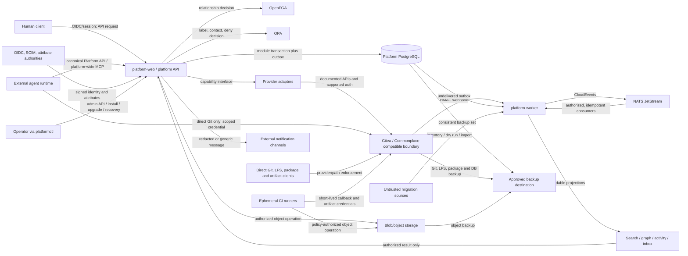

# Phase 0 Threat Model Baseline

| Field | Value |
|---|---|
| Status | Reconciled Phase 0 approval candidate; executable controls remain later-phase work |
| Primary owner | Workstream 13 — QA/security/release |
| Required reviewers | Workstream 1 — Architecture/standards; Workstream 6 — Identity/authorization/classification; affected provider/module owner |
| Final approval | Independent security approver and project owner |
| Review triggers | New trust boundary, provider, public contract, credential type, security-label profile, deployment profile, migration source, release process, or material threat; any security incident |
| Normative requirements | PRIN-002, PRIN-004, PRIN-005, PRIN-007, PRIN-011–015; ARCH-003–005; DOM-007–011; UX-006–009; AUTH-001–006; CLS-001–008; EVT-001–004; AUD-001–002; SRCH-003; GRAPH-001–002; STOR-002–003; CICD-002–005; MIG-001–005; DEP-004–005; OPS-001–004; SEC-002–006; TEST-002–010; AGENT-001–007 |

This document is the initial threat-model contract required by Phase 0. It does not assert that a control is implemented. Every finding ID below must be represented by a tracked issue and linked from the machine-readable [`security-findings.yaml`](../../specs/traceability/security-findings.yaml) register before its status can change. That register is linked from the requirements-to-tests matrix. A finding is closed only by evidence from the named tests and an independent security review.

## Security invariants

The following constraints are inherited unchanged from the master build directive:

1. Every protected operation is deny-by-default and passes authentication, trusted-attribute resolution, canonical-resource and effective-label resolution, OpenFGA, OPA, provider/path enforcement, and audit. No module may substitute its own authorization path.
2. Administrators, security officers, service principals, agents, and operators receive no implicit content or classification bypass.
3. A repository or other cloneable/provider container has one effective security label and security domain. Per-item markings cannot promise access restrictions the container cannot enforce.
4. Derived data uses the least-upper-bound/join of its sources and may not silently become less restrictive. A downgrade is a separate, denied-by-default workflow.
5. Search, activity, counts, graph edges, notifications, errors, logs, caches, temporary files, backups, exports, and provider metadata are protected data paths, not harmless projections.
6. PostgreSQL and the applicable Git/provider store are authoritative. NATS, search, activity, analytics, and graph indexes are replayable projections and do not become alternate systems of record.
7. Cross-domain or write-down transfer is denied and not automated by the core product. An external accredited process is required.
8. Stock Gitea is accessed only through documented APIs, webhooks, Git protocols, supported authentication, and supported configuration. Direct Gitea database access and a Gitea fork are prohibited.
9. Secrets do not enter Git, event payloads, telemetry, search indexes, audit content, or frontend state.
10. Security capability language must say “security-ready” or “FIPS-capable” where accurate; it must not imply certification, accreditation, authorization, or validation.
11. Identity contracts distinguish the acting principal from a human identity and reserve `user`, `agent`, and `service_account`. Actor, assignee, creator, reviewer, subscriber, and request-principal fields cannot assume a human.
12. An agent obtains no broad copy of a user’s permissions. A future allow is bounded by the intersection of delegating-principal authority, agent-specific authority, explicit task scope, runtime security-domain authorization, session/execution-environment restrictions, and resource classification/handling policy; agent/task revocation is independent of user revocation.
13. A future agent uses canonical Platform APIs and the platform-wide MCP boundary. Only direct Git protocol operations may reach the SCM provider, using separately scoped credentials. External runtimes, models, SDKs, providers and tools are untrusted integration boundaries, not required platform components.
14. Audit and CloudEvents preserve both `requested_by` and `actor`, principal type, delegation/task context, correlation and causation without a future schema break.
15. Team hierarchy and Project ownership/contribution express organization/accountability only; they create no authorization relation.
16. Missing, inactive, or unauthorized Project capabilities and their counts/navigation/routes are protected metadata and remain absent.
17. Organization-, Team-, and Project-scoped knowledge uses explicit container authorization and separate Git security boundaries where needed.

## Scope and assumptions

In scope are the baseline modular monolith, its upstream services, all direct and indirect access paths, supported deployment profiles, migration, CI/release production, backup/restore, and administrative operations. The model covers both connected and air-gapped installations.

The threat actors considered are an unauthenticated network actor; an authenticated user without need-to-know, clearance, compartment, or handling authorization; a malicious or compromised administrator; a compromised `agent` or `service_account` principal; a confused or malicious external agent runtime, model provider, SDK, tool server, or execution environment; a compromised browser, provider token, runner, webhook sender, dependency, migration source, or operator workstation; a tenant in another organization or security domain; and accidental misuse or configuration drift.

Network location is not trusted. External identity, attribute, object-storage, notification, source-migration, KMS, and provider systems are separate trust domains. Availability and recovery controls do not weaken confidentiality or integrity controls during degraded operation.

## Assets

| ID | Asset | Required protection |
|---|---|---|
| AST-01 | Source repositories, Git history, LFS objects, pull requests, reviews | Confidentiality by repository/security-domain boundary; Git hash and review integrity; availability and portable recovery |
| AST-02 | Work items, documents, comments, relationships, attachments | Content and existence confidentiality; canonical-schema and history integrity; label/provenance preservation |
| AST-03 | Identities, groups, trusted attributes, sessions, service principals | Authenticity, freshness, provenance, expiry, least privilege, revocation |
| AST-04 | OpenFGA models, tuples, OPA bundles, security-label profiles | Signed/versioned integrity, controlled rollout and rollback, complete audit, fail-closed evaluation |
| AST-05 | Credentials, secrets, signing keys, HMAC keys, encryption/KMS references | Non-disclosure, short lifetime where applicable, scoped use, rotation and revocation |
| AST-06 | Domain events, outbox, NATS streams, dead-letter records | Atomicity, integrity, authorization, minimization, replay safety, scoped ordering |
| AST-07 | Search, graph, activity, inbox, counts, facets, caches | Rebuildability, label propagation, non-disclosure including existence and inference |
| AST-08 | Packages, Actions artifacts, OCI images, releases, SBOMs and provenance | Origin and content integrity, authorization, signatures, vulnerability/license state |
| AST-09 | Audit records, policy decisions, upgrade and migration reports | Append-only integrity, attribution, controlled disclosure, retention and recoverability |
| AST-10 | Backups, exports, redirect maps, configuration and policy bundles | Complete recovery, encryption and domain partitioning, label/permission preservation |
| AST-11 | Availability of authorization, source control, core data and recovery mechanisms | Fail closed without corrupting acknowledged writes; documented degradation and restoration |
| AST-12 | Public contracts, provider interfaces, schemas, migrations and release metadata | Version integrity, compatibility, authenticated distribution, rollback safety |
| AST-13 | Principal types, delegation grants, task scopes, agent assignments, runtime context and revocation state | Explicit provenance, non-escalating intersection, independent revocation, schema stability, complete actor/requester attribution |

## Architecture and data-flow view

All arrows that carry protected resource information also carry or resolve organization, security-domain, effective security-label, actor, and correlation context. The diagram is logical; it does not authorize collapsing required schema, database, repository, runner-pool, storage, or security-domain boundaries.

### Trust boundaries

| ID | Boundary | Principal risks | Mandatory boundary controls |
|---|---|---|---|
| TB-01 | Client/browser ↔ platform API | Token theft, request tampering, UI-only enforcement, overbroad responses | Production TLS; server-side authorization; conditional writes; RFC 9457 non-leaking errors; CSP/CSRF/session controls; audit |
| TB-02 | Identity/attribute authorities ↔ platform | Forged, stale, self-asserted, or mis-mapped attributes | Issuer/audience/signature validation; trusted-source allowlist; provenance and expiry; fail closed; SCIM reconciliation |
| TB-03 | Core ↔ OpenFGA/OPA | Policy bypass, stale model, split decision, outage fail-open | One decision contract; pinned model/bundle versions; signed OPA bundle; timeouts deny; decision metadata in audit; conformance tests |
| TB-04 | Core/worker ↔ module-owned PostgreSQL data | Cross-module writes, SQL privilege escalation, partial transaction | Owned schemas/migrations; least-privilege DB roles; service interfaces; transactional outbox; integration tests |
| TB-05 | Worker ↔ NATS/consumers | Unauthorized subscription, replay duplication, poison event, content overexposure | Scoped credentials/subjects; minimal CloudEvents; idempotency; DLQ and controlled replay; retention policy |
| TB-06 | Platform ↔ stock Gitea/provider | Confused deputy, permission drift, undocumented dependency, malicious webhook | Capability-scoped adapter; scoped credentials; HMAC; reconciliation; compatibility tests; no internal DB/file access |
| TB-07 | Direct Git/LFS/API/package/artifact access ↔ provider | Central-policy bypass and existence leakage | Reconciled provider permissions plus gateway/network/credential controls for contextual policy; complete bypass suite |
| TB-08 | Platform ↔ object store/CDN/cache/temp storage | Bearer URL leakage, cross-domain reuse, stale copies | Short-lived scoped URLs; provider locator hidden; label/domain partitioning; invalidation; encrypted approved destination |
| TB-09 | Platform/provider ↔ CI runner | Runner impersonation, secret theft, escape, cross-domain artifact flow | Ephemeral isolated pools; short-lived job credentials; egress deny in secure profiles; no cross-pool caches; cleanup proof |
| TB-10 | Platform ↔ migration/import source | Hostile content, identity/label mis-mapping, silent data loss, cross-domain ingestion | Discovery and dry run; parser fuzzing; quarantine; explicit mappings/exceptions; provenance; resumable idempotent stages |
| TB-11 | Platform ↔ notification/export integration | Protected content sent to unauthorized channel/domain | Channel allowlist and classification decision; redaction/generic message; destination binding; explicit export audit |
| TB-12 | Live services ↔ backup/restore boundary | Incomplete snapshot, secret exposure, restore into wrong domain, rollback corruption | Consistent manifest; approved encrypted destination; integrity/signature checks; domain binding; automated restore test |
| TB-13 | Build/release system ↔ users/deployments | Dependency or action compromise, artifact substitution, false provenance | Pinned dependencies/actions; scans; SPDX SBOM; SLSA-compatible provenance; Sigstore/Cosign-compatible signatures |
| TB-14 | Security domain A ↔ security domain B | Unauthorized cross-domain or write-down transfer | No core transfer route; separate credentials/storage/indexes/runners/caches; deny export; external accredited process only |
| TB-15 | Operator/admin plane ↔ runtime | Privilege abuse, policy tampering, unsafe upgrade/rollback | Least privilege; no content bypass; two-person sensitive changes where required; signed inputs; preflight/backup/audit |
| TB-16 | External agent runtime/model/tool/execution environment ↔ Platform API/MCP and direct Git | Broad inherited human authority, forged delegation, prompt/tool injection, model-provider exfiltration, wrong-domain runtime, unrevoked task token, actor/requester ambiguity | First-class principal type; explicit resource/task delegation; six-way authority intersection; independently revocable short-lived credentials; runtime domain/ceiling/compartment/model-provider/tool-scope/environment inputs; canonical API/MCP only; scoped Git exception; dual attribution and audit |

### Protected data flows

| ID | Flow | Security and classification behavior |
|---|---|---|
| DF-01 | Sign-in, provisioning, and attribute synchronization | Accept configured authorities only; preserve authority, issue/review/expiry, version, provenance and sensitivity; reject expired or unverifiable attributes. |
| DF-02 | Synchronous read/write through platform API | Resolve canonical resource and effective label before OpenFGA and OPA; apply explicit denies and provider check; return only authorized fields and non-leaking errors; audit decision metadata. |
| DF-03 | Domain mutation → outbox → NATS → consumer | Domain write and outbox are atomic; event carries required security metadata and minimized content; publish/consume is idempotent; subscription and replay remain domain-scoped. |
| DF-04 | Platform core/worker ↔ Gitea/Commonplace/provider | Use only owned capability interface and documented upstream contract; bind scoped credential to organization/domain; validate response; reconcile drift; audit mutation. |
| DF-05 | Direct Git clone/push, LFS, API, package, artifact and release access | Provider enforcement cannot exceed the central grant. Context the provider cannot evaluate is enforced by gateway, network/security domain, or credential issuance; tests cover every direct route. |
| DF-06 | Git/OKF document edit, review, publish and clone | Repository is the secrecy boundary; deterministic safe Markdown; no executable MDX/scripts/unsafe HTML; approved revision hash, provenance and label remain intact. |
| DF-07 | Event → search/graph/activity/inbox projection → query | Project using label/domain metadata; invalidate on label/permission change; coarse prefilter then authoritative OpenFGA/OPA; never leak totals, snippets, edges, identifiers or existence. |
| DF-08 | Notification → external channel | In-app record remains canonical. Evaluate channel/destination against label; redact to a generic protected-update notice when allowed, otherwise deny; preserve audit without copying content. |
| DF-09 | Workflow → runner → secret/artifact callback | Assign only to matching domain/classification pool; issue short-lived job-bound credentials; redact logs; verify cleanup; label outputs by source join. |
| DF-10 | Attachment/object upload and download | Validate size/type/hash and optional malware status; bind owner/container/label/retention; authorize each access or issue narrowly scoped, short-lived URL; prevent locator disclosure. |
| DF-11 | External source → migration inventory/dry run/import/reconciliation | Treat source data as untrusted; map identities, ontology and labels explicitly; quarantine uncertain data; preserve provenance and unsupported constructs; prevent partial visibility before validation. |
| DF-12 | Authoritative stores → backup → restore | Capture the complete required set consistently; protect at maximum applicable domain/label; verify manifest/signature/encryption; restore into compatible domain and revalidate IDs, labels, permissions and hashes. |
| DF-13 | Export/share/copy/print or cross-domain request | Apply OPA data-flow and downgrade rules; deny cross-domain/write-down in core; require external accredited transfer; include markings and audit. |
| DF-14 | Policy/model/schema/config upgrade and rollback | Authenticate and authorize change; validate signature/version/migration; canary/preflight where applicable; record before/after hashes; roll back only to compatible, non-weaker state. |
| DF-15 | User/principal → agent delegation/assignment → external runtime → Platform API/MCP or direct Git | Record `user`/`agent`/`service_account`, delegator, task/resource scope and independent revocation. Evaluate the intersection of delegator, agent, task, runtime domain/ceiling/compartments, session/environment and resource policy. API/MCP uses the shared authorization path; direct Git receives a separate minimum-scope credential. Events/audit record both requester and actor. |

### Security-domain flow rules

| Situation | Required result |
|---|---|
| Resource label exceeds installation ceiling | Reject creation/import; do not persist a lower substitute label. |
| Derived resource has sources at different levels/compartments | Apply the defined least-upper-bound/join and retain derivation sources. |
| Principal has project administration but insufficient clearance/compartment | Deny content access; administrative role is not a bypass. |
| Same security domain, but missing need-to-know | Deny through OpenFGA even if OPA classification dominance succeeds. |
| Provider cannot evaluate device, network, time, or session context | Enforce through access gateway, security-domain network controls, or scoped credential issuance; otherwise disable that path. |
| Label is raised | Invalidate and reconcile provider grants, credentials, search, counts, graphs, notifications, exports, caches and outstanding object URLs before further access. |
| Label is lowered/declassified/decontrolled | Deny by default; require authorized role, written reason/source authority, complete audit and US-government two-person approval. |
| Flow crosses security domains or writes down | Deny. The initial core release has no cross-domain implementation. |
| Air-gapped deployment attempts an unapproved egress | Deny and surface an auditable diagnostic without transmitting payload data. |

## Credential inventory and lifecycle

| ID | Credential | Holder and scope | Required lifecycle/control | Compromise response |
|---|---|---|---|---|
| CRD-01 | OIDC authorization code, ID/access token and platform session | Human browser; one issuer/client/session ceiling | PKCE/state/nonce; secure cookie; issuer/audience/time validation; shortest practical session; no frontend persistence of service secrets | Revoke session/token; invalidate cached authorization; audit affected access |
| CRD-02 | SCIM/attribute-authority credential | Identity adapter only; configured tenant/authority | Secret provider; read/write scope minimized; rotation and sync provenance; fail closed on unverifiable attributes | Disable sync, expire affected attributes, reconcile and audit |
| CRD-03 | Service/workload identity | One service/provider capability and domain | Short-lived credential; mTLS/workload identity where supported; no shared super-token | Revoke identity, rotate, reconcile actions and affected data |
| CRD-04 | Gitea OAuth/admin/provider token | Gitea adapter; capability-scoped | Supported auth only; separate admin bootstrap from steady state; secret provider; never expose to browser | Revoke/rotate, validate provider permissions and webhook state |
| CRD-05 | Git SSH key/HTTPS credential/API token | User or service; repositories and domain granted by central model | Scoped issuance/reconciliation; expiration/revocation; contextual gateway when required | Revoke at provider/gateway; invalidate access cache; audit clones/pushes where available |
| CRD-06 | Webhook HMAC secret | Provider sender and webhook receiver | Unique per integration/domain; constant-time verification; timestamp/replay defense; dual-key rotation | Disable endpoint, rotate, replay verified events after reconciliation |
| CRD-07 | NATS account/user credential | Producer or consumer; exact subjects/domain | Scoped publish/subscribe; short-lived or rotated; TLS; no wildcard across domains | Revoke, inspect stream/DLQ, rebuild projections from authoritative stores |
| CRD-08 | PostgreSQL/OpenFGA datastore credential | Single service/schema | Separate least-privilege roles; TLS in production; migration role not used at runtime | Rotate; validate logs and ownership boundaries; restore if integrity affected |
| CRD-09 | Object-store credential or presigned URL | Blob adapter, job, or one recipient/object | Domain/container-bound; minimal operation; short expiry; locator hidden; no cross-domain cache | Revoke/expire; invalidate cache; rotate provider key; review downloads |
| CRD-10 | Runner registration/job token and injected secret | One ephemeral runner/job/pool | Attested/approved image where configured; single job; memory/files cleanup; redacted logs; egress policy | Terminate/quarantine runner and outputs; revoke all job secrets; rebuild on trusted pool |
| CRD-11 | Artifact/release signing key | Dedicated release signer | Protected signer/KMS; separation of duties; keyless or short-lived identity where supported; verification material distributed | Revoke identity/key, publish revocation, quarantine and rebuild affected artifacts |
| CRD-12 | Backup encryption/key reference | Backup/restore service and authorized operator | Separate from backup payload; approved destination; rotation without orphaning recovery; restore drill | Quarantine copies, rotate wrapping keys, test alternate clean restore |
| CRD-13 | Migration-source credential | Migration connector for one source/run | Read-only where possible; source/domain-bound; expire after cutover; never persist in report/event | Revoke, pause/quarantine run, assess imported provenance and restart idempotently |
| CRD-14 | Future agent delegation/task credential | One `agent` principal, explicit delegator, task, resources, tools, runtime domain/environment and bounded time | Never clone a human session or inherit all human permissions; issue only after the six-way policy intersection; independently revocable; canonical API/MCP scope; separate scoped Git credential if required | Revoke task and agent grants independently, expire API/MCP and Git credentials, cancel future callbacks, invalidate caches, audit requester/actor and assess actions already taken |

## STRIDE analysis and tracked findings

Severity expresses the worst credible impact before implementation controls. `OPEN-P0` means the control and test contract must be approved in Phase 0 and implemented before the release gate named in the issue. It does not mean risk is accepted.

| Finding | STRIDE | Threat / affected assets | Required mitigation and verification | Owner | Severity | Status |
|---|---|---|---|---|---|---|
| TM-F001 | S, E, I | Forged/stale identity or self-asserted trusted attributes permit access (AST-02–05) | Define issuer/attribute contract, provenance/expiry checks, revocation and fail-closed tests for AUTH-001/005 and TEST-004 | WS-06 Identity/authorization/classification | Critical | OPEN-P0 |
| TM-F002 | E, I | Admin, security officer, operator or service role becomes an implicit content bypass | Model role/need-to-know separation; test admin-without-clearance and officer-without-content access | WS-06 | Critical | OPEN-P0 |
| TM-F003 | E, I | Direct Git/API/LFS/package/artifact/runner/object/webhook path exceeds central policy | Complete `classification-bypass-inventory.md`; specify provider reconciliation/gateway/credential controls; run every `CBI-*` test | WS-06 with WS-03/09/10/13 | Critical | OPEN-P0 |
| TM-F004 | I | Counts, facets, snippets, edges, errors, notifications or timing reveal protected existence (AST-07) | Coarse partitioning plus authoritative result filtering; non-disclosure fixtures and negative assertions for every aggregation surface | WS-08 Search/work graph with WS-07/13 | Critical | OPEN-P0 |
| TM-F005 | T, I | Label/permission change leaves stale projections, caches, URLs, notifications or provider grants | Versioned effective-label contract; ordered invalidation/reconciliation; label-raise propagation and race tests | WS-06 with WS-03/07/08/10 | Critical | OPEN-P0 |
| TM-F006 | I, T, R | Event payload or unauthorized subscription leaks content; replay duplicates or corrupts state | Minimized labeled CloudEvents, subject ACLs, idempotency and DLQ/replay tests; audit correlation | WS-07 Events/activity/inbox/audit | High | OPEN-P0 |
| TM-F007 | S, E, I | Shared, long-lived or over-scoped service/provider credentials create a confused deputy | Credential contract per `CRD-*`; capability/domain scoping, short life, rotation and negative-scope tests | WS-06 with each credential-owning workstream | Critical | OPEN-P0 |
| TM-F008 | S, T, D | Forged/replayed webhooks or provider event storms mutate or exhaust the platform | HMAC validation, anti-replay, rate/size limits, idempotency, full reconciliation and fuzz/failure tests | WS-03 Gitea/provider with WS-07/13 | High | OPEN-P0 |
| TM-F009 | T, E, R | Module or adapter writes another module’s/upstream database, bypassing contracts and audit | Schema ownership and DB-role matrix; static checks, migration tests and runtime integration denial | WS-02 Platform core/domain with WS-01/13 | High | OPEN-P0 |
| TM-F010 | T, I, E | Hostile or mislabeled migration content exploits parsers, maps identities incorrectly, or enters a lower domain | Quarantined discovery/dry run; explicit identity/ontology/label mapping; parser fuzzing; provenance and reconciliation | WS-11 Migration with WS-06/13 | Critical | OPEN-P0 |
| TM-F011 | E, I, T | Runner escape, secret theft, log leakage or wrong-pool scheduling crosses projects/domains | Ephemeral isolated pools, short-lived secrets, egress deny, label-aware scheduling, cleanup and cross-pool negative tests | WS-09 CI/runners/artifacts/secrets | Critical | OPEN-P0 |
| TM-F012 | I, T | Presigned URLs, shared caches, temp files or provider locators outlive/reveal authorization | Domain-partitioned storage/cache/temp; scoped short-lived URL; revocation/invalidation; residue and URL-replay tests | WS-10 Storage with WS-06/13 | Critical | OPEN-P0 |
| TM-F013 | T, E, R | Unauthorized downgrade/declassification removes source restrictions | Formal label lattice/join; denied default; written authority; audit; two-person US-government flow and concurrency tests | WS-06 | Critical | OPEN-P0 |
| TM-F014 | R, I, T | Audit omits direct-provider/admin activity, is mutable, or copies secrets/content | Append-only schema; complete coverage; controlled deltas/hashes; redaction tests; signed checkpoints when implemented | WS-07 with all emitting workstreams/13 | High | OPEN-P0 |
| TM-F015 | T, E | Compromised dependency, action, image, chart or build produces a trusted release | Approval workflow, pinning, scans, SBOM, provenance and signing; quarantine/rebuild/revocation drill | WS-09 with WS-12/13 | Critical | OPEN-P0 |
| TM-F016 | T, I, D | Incomplete, mislabeled or compromised backup/restore loses data or restores it into a weaker domain | Consistent manifest, domain binding, encryption/integrity verification; generated-data restore and wrong-domain rejection tests | WS-12 Installation/operations with WS-13 | Critical | OPEN-P0 |
| TM-F017 | I, E | Export, copy/share or integration implements unapproved cross-domain/write-down transfer | No core route; explicit deny; channel/destination allowlist; cross-domain negative tests and audit | WS-06 with WS-10/12/13 | Critical | OPEN-P0 |
| TM-F018 | T, E, D | Unsigned, incompatible or rolled-back OpenFGA/OPA/schema/config weakens decisions or locks out service | Signed/versioned artifacts; model/policy migration tests; preflight; compatible rollback; before/after audit | WS-06 with WS-01/12/13 | Critical | OPEN-P0 |
| TM-F019 | T, E, I | Direct Gitea changes or provider-version drift violates canonical workflow, permissions or labels | Accept/reconcile only valid changes; reject/reset invalid ones with audit; pinned compatibility matrix and nightly/RC tests | WS-03 | High | OPEN-P0 |
| TM-F020 | T, E, I, D | Markdown/frontmatter, archive, API or import parser executes active content or consumes unbounded resources | Reject executable MDX/scripts/unsafe HTML; safe extraction; size/depth/time limits; fuzz and malicious-corpus tests | WS-04 Knowledge with WS-11/13 | High | OPEN-P0 |
| TM-F021 | D, E | OpenFGA/OPA/provider outage causes fail-open behavior or unsafe partial writes | Explicit timeout/error deny; transactional boundaries; degraded-mode contract; failure/chaos tests and recovery audit | WS-02/06 with WS-13 | Critical | OPEN-P0 |
| TM-F022 | E, I, R | MCP/agent gains direct repository, DB, NATS, search or object-store access or unattributed writes | Same platform API/authorization path as humans; scoped service principal; no direct stores; attribution/audit tests | WS-08 Search/work graph/AI with WS-06/13 | High | OPEN-P0 |
| TM-F023 | S, T, R | Signature/provenance metadata is valid but bound to the wrong artifact/version | Bind digest, version, builder identity and source revision; verify before install/upgrade; substitution tests | WS-09 with WS-12/13 | High | OPEN-P0 |
| TM-F024 | I, D | Telemetry, diagnostics, crash reports or support bundles capture protected bodies or secrets | Allowlisted structured fields, redaction at source, domain-aware export, canary-secret/content leakage tests | WS-12 Installation/operations with WS-13 | High | OPEN-P0 |
| TM-F025 | S, E, I | Contracts treat an agent/service account as a human or copy the delegating user’s broad permissions, allowing assignment/delegation escalation | Reserve canonical principal types; explicit delegation/resource/task model; independent revocation; six-way authorization intersection; negative model/contract tests | WS-06 with WS-01/02/13 | Critical | OPEN-P0 |
| TM-F026 | E, I, T | External agent runtime, model provider, SDK, tool server or execution environment is trusted implicitly, lies about domain/ceiling/compartments/tool scope, or exfiltrates protected data | Treat runtime context as trusted-source policy inputs with provenance; provider/tool allowlists; canonical API/MCP boundary; least response data; no required model/provider; deny unverifiable context | WS-06 with WS-08/13 | Critical | OPEN-P0 |
| TM-F027 | R, S | Event/audit schemas conflate initiating user with acting agent, preventing attribution or hiding delegation misuse | Schema fields for actor, principal type, requested-by/initiator, delegation/task, correlation and causation; immutable tests using different requester/actor | WS-07 Events/activity/inbox/audit with WS-01/06/13 | High | OPEN-P0 |
| TM-F028 | E, I | An agent bypasses canonical policy through provider business APIs or receives overbroad direct Git credentials | Prohibit provider-specific business API access; Platform API/MCP only; allow direct Git protocol solely with resource/domain/task-scoped credential; revocation and non-enumeration tests | WS-08 with WS-03/06/13 | Critical | OPEN-P0 |
| TM-F029 | E, I | Team parentage or Project owning/contributing Team is mistakenly treated as authorization inheritance | Keep hierarchy/accountability relations separate in schema and OpenFGA; no computed parent viewer/member; explicit tuple required; hierarchy model/E2E tests | WS-06 with WS-01/02/13 | Critical | OPEN-P0 |
| TM-F030 | I | Disabled or unauthorized capabilities leak through tabs, routes, commands, counts, suggestions, notifications, or relationship summaries | Server-derived capability+authorization response; absent metadata rather than disabled shell; route and aggregate non-disclosure tests | WS-05/08 with WS-06/13 | High | OPEN-P0 |
| TM-F031 | E, I | Organization/Team knowledge container is mis-bound to a Project or shared Git repository, granting unintended clone/search/export access | Exactly-one canonical container; repository is security boundary; separate repos for different policy; import/search/export container tests | WS-04 with WS-01/06/13 | Critical | OPEN-P0 |
| TM-F032 | T, E, I | Devlane routes or software-specific ontology become canonical API/security assumptions, bypassing capability and general-work controls | Platform OpenAPI/OWGP only; static route/provider boundary tests; general-project golden test; ontology terms rejected | WS-01/05 with WS-06/13 | High | OPEN-P0 |
| TM-F033 | E, I | Agent/AgentRun Phase 0 schemas are used to smuggle an executor, dispatch, prompt/model integration, or tool catalog into the trusted platform | Contract-only directories and dependency guard; repository inventory; no executable endpoints/services/dependencies; future approved issue and threat review required | WS-01/08/13 | High | OPEN-P0 |

### Finding-to-issue tracking

Every finding is a tracked child requirement of `STEAD-P0-014` (threat/test/release contract) and the named owning contract or implementation issues below. Closing the Phase 0 parent means the control and test plan is approved; it does **not** close the executable risk. A finding remains `OPEN-P0` until the applicable later issue supplies passing evidence and independent review.

| Finding | Owning Phase 0 issue(s) | Planned executable issue(s) |
|---|---|---|
| `TM-F001` | `STEAD-P0-007`, `STEAD-P0-014` | `STEAD-P1-006`, `STEAD-P2-004` |
| `TM-F002` | `STEAD-P0-007`, `STEAD-P0-014` | `STEAD-P1-006`, `STEAD-P2-004` |
| `TM-F003` | `STEAD-P0-004`, `STEAD-P0-007`, `STEAD-P0-010`, `STEAD-P0-011`, `STEAD-P0-014` | `STEAD-P1-003`, `STEAD-P1-009`, `STEAD-P1-010`, `STEAD-P1-012`; expanded in Phase 2 owners |
| `TM-F004` | `STEAD-P0-008`, `STEAD-P0-009`, `STEAD-P0-014` | `STEAD-P1-008`, `STEAD-P1-012`, `STEAD-P2-006` |
| `TM-F005` | `STEAD-P0-004`, `STEAD-P0-007`–`009`, `STEAD-P0-011`, `STEAD-P0-014` | `STEAD-P1-003`, `STEAD-P1-006`–`008`, `STEAD-P1-010`, `STEAD-P1-012` |
| `TM-F006` | `STEAD-P0-008`, `STEAD-P0-014` | `STEAD-P1-007`, `STEAD-P1-012`, `STEAD-P2-005` |
| `TM-F007` | `STEAD-P0-007`, `STEAD-P0-014` plus each credential-owning P0 issue | Corresponding credential-owning Phase 1–3 issue plus its independent gate |
| `TM-F008` | `STEAD-P0-004`, `STEAD-P0-008`, `STEAD-P0-014` | `STEAD-P1-003`, `STEAD-P1-007`, `STEAD-P1-012` |
| `TM-F009` | `STEAD-P0-003`, `STEAD-P0-014` | `STEAD-P1-002`, `STEAD-P1-012` |
| `TM-F010` | `STEAD-P0-012`, `STEAD-P0-014` | `STEAD-P2-009`, `STEAD-P2-011`, `STEAD-P3-006` |
| `TM-F011` | `STEAD-P0-010`, `STEAD-P0-014` | `STEAD-P1-009`, `STEAD-P1-012`, `STEAD-P2-007` |
| `TM-F012` | `STEAD-P0-011`, `STEAD-P0-014` | `STEAD-P1-010`, `STEAD-P1-012`, `STEAD-P2-008` |
| `TM-F013` | `STEAD-P0-007`, `STEAD-P0-014` | `STEAD-P2-004`, `STEAD-P2-011`, `STEAD-P3-002` |
| `TM-F014` | `STEAD-P0-008`, `STEAD-P0-014` | `STEAD-P1-007`, `STEAD-P1-012`, `STEAD-P2-005`, `STEAD-P3-003` |
| `TM-F015` | `STEAD-P0-001`, `STEAD-P0-010`, `STEAD-P0-013`, `STEAD-P0-014` | `STEAD-P1-001`, `STEAD-P1-009`, `STEAD-P1-012`, `STEAD-P3-005` |
| `TM-F016` | `STEAD-P0-013`, `STEAD-P0-014` | `STEAD-P1-011`, `STEAD-P1-012`, `STEAD-P2-010`, `STEAD-P3-007` |
| `TM-F017` | `STEAD-P0-007`, `STEAD-P0-011`–`014` | `STEAD-P2-004`, `STEAD-P2-008`–`011`, `STEAD-P3-002`, `STEAD-P3-007` |
| `TM-F018` | `STEAD-P0-007`, `STEAD-P0-013`, `STEAD-P0-014` | `STEAD-P1-006`, `STEAD-P1-011`, `STEAD-P1-012` |
| `TM-F019` | `STEAD-P0-004`, `STEAD-P0-014` | `STEAD-P1-003`, `STEAD-P1-012`, `STEAD-P2-001` |
| `TM-F020` | `STEAD-P0-005`, `STEAD-P0-012`, `STEAD-P0-014` | `STEAD-P1-004`, `STEAD-P1-012`, `STEAD-P2-002`, `STEAD-P2-009` |
| `TM-F021` | `STEAD-P0-003`, `STEAD-P0-007`, `STEAD-P0-014` | `STEAD-P1-002`, `STEAD-P1-006`, `STEAD-P1-012` |
| `TM-F022` | `STEAD-P0-009`, `STEAD-P0-014`, `STEAD-P0-015` | `STEAD-P2-006`, `STEAD-P2-011`, `STEAD-P3-004`; executable agent behavior requires a new approved future issue |
| `TM-F023` | `STEAD-P0-010`, `STEAD-P0-013`, `STEAD-P0-014` | `STEAD-P1-009`, `STEAD-P1-011`, `STEAD-P1-012`, `STEAD-P3-005`, `STEAD-P3-007` |
| `TM-F024` | `STEAD-P0-013`, `STEAD-P0-014` | `STEAD-P1-011`, `STEAD-P1-012`, `STEAD-P2-010` |
| `TM-F025` | `STEAD-P0-002`, `STEAD-P0-003`, `STEAD-P0-007`, `STEAD-P0-014`, `STEAD-P0-015` | `STEAD-P1-002`, `STEAD-P1-006`, `STEAD-P1-012`; executable agent behavior requires a new approved future issue |
| `TM-F026` | `STEAD-P0-007`, `STEAD-P0-009`, `STEAD-P0-013`–`015` | Compatibility seam only; executable runtime/model/tool integration requires a new approved future issue |
| `TM-F027` | `STEAD-P0-008`, `STEAD-P0-014`, `STEAD-P0-015` | `STEAD-P1-007`, `STEAD-P1-012`; executable agent behavior requires a new approved future issue |
| `TM-F028` | `STEAD-P0-004`, `STEAD-P0-007`, `STEAD-P0-009`, `STEAD-P0-014`, `STEAD-P0-015` | `STEAD-P2-001`, `STEAD-P2-006`, `STEAD-P2-011`; executable agent behavior requires a new approved future issue |
| `TM-F029` | `STEAD-P0-002`, `STEAD-P0-003`, `STEAD-P0-007`, `STEAD-P0-014` | `STEAD-P1-002`, `STEAD-P1-006`, `STEAD-P1-012` |
| `TM-F030` | `STEAD-P0-006`, `STEAD-P0-007`, `STEAD-P0-009`, `STEAD-P0-014` | `STEAD-P1-005`, `STEAD-P1-008`, `STEAD-P1-012` |
| `TM-F031` | `STEAD-P0-002`, `STEAD-P0-005`, `STEAD-P0-007`, `STEAD-P0-014` | `STEAD-P1-002`, `STEAD-P1-004`, `STEAD-P1-012` |
| `TM-F032` | `STEAD-P0-001`, `STEAD-P0-006`, `STEAD-P0-014` | `STEAD-P1-001`, `STEAD-P1-005`, `STEAD-P1-012` |
| `TM-F033` | `STEAD-P0-001`, `STEAD-P0-009`, `STEAD-P0-014`, `STEAD-P0-015` | Future separately approved agent-execution issue only |

### Threat-family coverage summary

| STRIDE family | Primary finding IDs |
|---|---|
| Spoofing | TM-F001, TM-F007, TM-F008, TM-F023, TM-F025–027 |
| Tampering | TM-F008–010, TM-F013–016, TM-F018–020, TM-F023, TM-F026 |
| Repudiation | TM-F006, TM-F009, TM-F013–014, TM-F022–024, TM-F027 |
| Information disclosure | TM-F001–007, TM-F010–012, TM-F014, TM-F016–017, TM-F020, TM-F022, TM-F024–026, TM-F028 |
| Denial of service | TM-F008, TM-F020–021 |
| Elevation of privilege | TM-F001–003, TM-F007, TM-F009–013, TM-F017–018, TM-F022, TM-F025–026, TM-F028 |

## Provider-bypass analysis

The platform API is not the only ingress. A user or service can interact directly with Git over SSH/HTTPS, LFS, Gitea APIs and tokens, packages, artifacts, releases, runner callbacks, object storage, and webhooks. Provider permissions therefore must be a non-escalating projection of the central decision, not an independent grant. Contextual restrictions unavailable in Gitea must be enforced before credential issuance or at an access gateway/network/security-domain boundary. If equivalent enforcement is unavailable, that direct path is disabled for the security profile.

`classification-bypass-inventory.md` is the authoritative Phase 0 inventory for these and secondary leakage paths. It includes the future agent Platform API/MCP boundary, scoped direct Git exception, delegation/task revocation, runtime-context intersection and dual attribution. `TM-F003` and `TM-F025`–`TM-F028` cannot close until every applicable inventory row has a named control owner, executable negative test, acceptable residual risk, and independent result. Government-classification readiness is prohibited while any direct path can exceed central policy.

## Migration and import hazards

Migration inputs are hostile even when their source system is trusted. Importers must defend against malformed archives, path traversal, decompression bombs, unsafe HTML/macros, identity collisions, link poisoning, duplicate/reordered updates, impossible canonical mappings, labels above the installation ceiling, missing label metadata, and partial/retried execution. Discovery and dry run occur before visibility. Ambiguous identity or label mappings are quarantined for authorized resolution; they are never guessed down to a less restrictive label. Source credentials are run-scoped and revoked after cutover. Original identifiers, URLs, unsupported constructs, and provenance remain visible in the final report without becoming new canonical semantics.

Required issue coverage: TM-F010, TM-F020, TM-F024, MIG-001–005, TEST-002/004/006. Tests include malicious parser corpora, fuzzing, idempotent resume, rollback/restart, reconciliation, wrong-domain rejection, duplicate identity handling, unsupported-construct reporting, and protection of redirects and reports.

## Supply-chain hazards

The supply chain includes source commits, inherited Devlane material, Go/npm/system dependencies, build images, Gitea Actions, runner images, charts, air-gap bundles, signatures, scanners, generated code, and release tooling. Trusting a registry name or a valid signature alone is insufficient: the artifact digest, source revision, builder identity, policy result, license decision, SBOM and provenance must bind to the same release candidate.

Required controls are immutable pinning, an internally mirrored approved action catalog for secure profiles, dependency/license/secret/SAST/image/IaC scans, minimal images, non-root/read-only/drop-capability settings where feasible, SPDX 3.0 SBOMs, SLSA-compatible provenance, checksums, third-party notices, and Sigstore/Cosign-compatible signatures. Unknown or disputed components are quarantined, not silently allowed. See `../governance/license-and-dependency-approval.md`; findings TM-F015 and TM-F023 remain release blockers until evidence is verified.

## Recovery and resilience controls

| Failure or compromise | Fail-safe behavior | Recovery evidence required |
|---|---|---|
| OpenFGA/OPA or trusted-attribute authority unavailable | Deny protected operations that need an unavailable decision; do not reuse attributes beyond their authorized validity | Chaos test, denial audit, service recovery and decision-version check |
| Provider unavailable or webhook delivery lost | Preserve acknowledged platform transaction/outbox; queue retry; do not invent provider success; reconcile from documented APIs | Outage/retry test, idempotent reconciliation report |
| NATS unavailable or stream lost | Keep authoritative domain/outbox state; resume publication; rebuild projections from stores/events where available | Atomic outbox, restart, DLQ/replay and projection rebuild tests |
| Search/activity/inbox unavailable | Degrade without bypassing through raw unfiltered results; core authorized reads/writes remain defined | Failure E2E and non-disclosure assertions |
| Credential compromise | Revoke/rotate affected scope; invalidate caches/URLs/sessions; reconcile provider state; preserve audited response | Rotation drill and post-revocation negative access test |
| Runner or build compromise | Quarantine runner and all outputs; revoke job credentials; rebuild from trusted inputs/pool; do not sign/release suspect output | Incident rehearsal, clean rebuild, provenance comparison |
| Failed migration | Stop/quarantine run; resume idempotently or roll back staged visibility; retain source and diagnostic provenance | Fault-injection, restart, duplicate and reconciliation tests |
| Failed upgrade or policy/model rollout | Stop on preflight/smoke failure; use compatible rollback only; restore verified backup when data migration prevents rollback | Upgrade rollback/recovery report and authorization regression suite |
| Data-store or object loss | Restore the consistent required backup set; rebuild projections; verify IDs, permissions, labels, hashes, URLs and audit | Automated representative backup/restore suite |
| Suspected release compromise | Quarantine artifacts and air-gap bundles; publish revocation/known-issue data; rotate signer if required; issue rebuilt signed release | Signature rejection and artifact-substitution drill |

## Required Phase 0 security test contracts

Before Phase 0 approval, tests may be specifications rather than executable code, but each must have a stable test ID, owner, fixture definition, expected allow/deny result, evidence location, and mapped requirement/finding. At minimum the security plan must define:

- the full classification decision matrix in TEST-004;
- every bypass row in `classification-bypass-inventory.md`;
- policy/model decision-table, migration, signature and rollback tests;
- hostile webhook, Markdown/frontmatter, archive, importer and API-parser fuzz corpora;
- event subscription, minimization, replay, out-of-order and idempotency tests;
- secret and protected-content canaries for events, logs, audit, errors, notifications, caches, temp files, SBOM/provenance, and support bundles;
- provider outage, authz outage, stale-policy, race-on-label-raise and race-on-revocation tests;
- runner pool, cache, credential and artifact cross-domain negative tests;
- wrong-domain backup/restore and cross-domain export denials;
- release artifact substitution, signing and offline verification tests.
- principal-schema tests proving acting/requesting contexts accept `user`, `agent`, and `service_account` where applicable, Work assignment accepts exactly `user` or `agent`, and no principal kinds are treated as interchangeable;
- OpenFGA/OPA future-compatibility vectors for explicit delegation, task/resource scope, independent revocation, no broad human inheritance, and runtime domain/ceiling/compartment/model-provider/tool-scope/execution-environment inputs;
- event/audit schema vectors with `requested_by = user:alice` and `actor = agent:backend-agent`, principal type, delegation/task, correlation and causation;
- API/MCP and direct-Git negative contracts showing an agent cannot call provider business APIs, exceed task scope, reuse a revoked delegation, or use a Git credential outside its exact repository/domain/task.

## Phase 0 agent boundary and non-goal

Phase 0 preserves schemas, authorization seams, audit/event attribution and integration boundaries for later agent support. It does **not** build agent execution or orchestration, prompting, model hosting, agent memory, `AgentRun` execution, A2A dispatch, a future Agent Registry, or the full MCP tool catalog. A2A/Agent Card and MCP references define future interoperability and contract compatibility only. No Phase 0 dependency, runtime service or implementation issue may smuggle these features into scope.

## Acceptance and maintenance

Phase 0 threat-model approval requires all trust boundaries, flows, credential types and findings to have an owner; every finding to be present in the issue hierarchy and traceability matrix; every Critical/High finding to have a planned automated test and release gate; the bypass inventory to be complete; and Architecture, Identity/authorization/classification, QA and independent security reviewers to approve the baseline. Approval freezes the boundary model for implementation. A later change follows threat-model review and, when it changes a locked architecture decision, an ADR plus project-owner approval.

No release may ship with an open Critical finding, a known unauthorized-disclosure path, a missing required security test, or a finding marked closed without test evidence. A High vulnerability may receive only the time-bounded waiver permitted by TEST-008 and the release-gate policy; architectural High threat findings remain open until their required control is implemented and verified.
